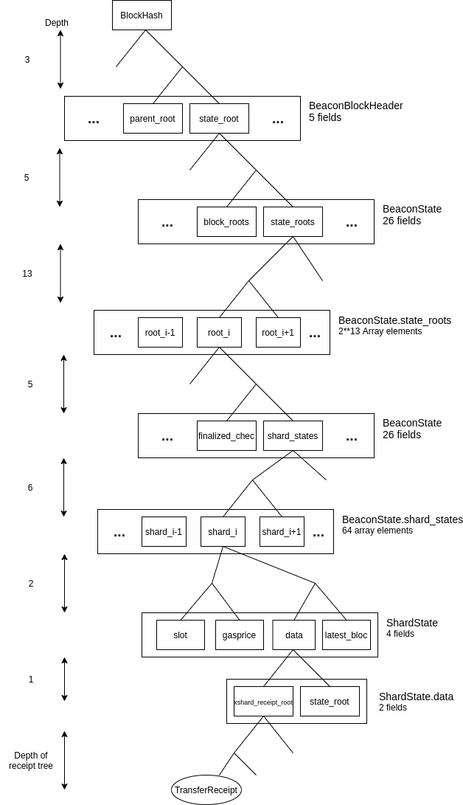

# Eth1x64 Initial Variant (Variant 1)

- [Background](#background)
- [Requirements](#requirements)
- [Overview of solution](#overview-of-solution)
  - [Ether transfer](#ether-transfer)
  - [Sending a message](#sending-a-message)
  - [Further capabalities](#further-capabalities)
- [Specification](#specification)
  - [Eth1 block header: MessageReceipt](#eth1-block-header-messagereceipt)
  - [Eth1 block header: claimedReceiptsHash](#eth1-block-header-claimedreceiptshash)
  - [Opcode: SHARDID](#opcode-shardid)
    - [Gas cost analysis](#gas-cost-analysis)
  - [Opcode: BEACONBLOCKHASH](#opcode-beaconblockhash)
    - [Gas cost analysis](#gas-cost-analysis)
  - [Opcode: XMSG](#opcode-xmsg)
    - [Gas cost analysis](#gas-cost-analysis)
  - [Opcode: XCLAIM](#opcode-xclaim)
    - [Gas cost analysis](#xclaim-gas-cost-analysis)
  - [Opcode: XSHARDID](#opcode-xshardid)
    - [Gas cost analysis](#gas-cost-analysis)
  - [Opcode: XSENDER](#opcode-xsender)
    - [Gas cost analysis](#gas-cost-analysis)
  - [Receipt proof](#receipt-proof)
- [Appendix A: Transaction examples](#appendix-a-transaction-examples)
  - [Proxy contract](#proxy-contract)
    - [Sending Ether from an EOA](#sending-ether-from-an-eoa)
    - [Receiving (claiming) Ether by an EAO](#receiving-claiming-ether-by-an-eao)
  - [Rich transactions](#rich-transactions)
    - [Sending Ether from an EOA](#sending-ether-from-an-eoa)
    - [Receiving (claiming) Ether by an EAO](#receiving-claiming-ether-by-an-eao)
- [Appendix B: Addressing and transaction format](#appendix-b-addressing-and-transaction-format)
- [Appendix C: Token examples](#appendix-c-token-examples)

## Background

This document goes into one variant of the [Eth1x64](https://ethresear.ch/t/the-eth1x64-experiment/7195) experiment. Eth1x64 builds on [Phase 1.5](https://ethresear.ch/t/alternative-proposal-for-early-eth1-eth2-merge/6666) and explores the "put Eth1 on every shard" idea. The main motivations of this thought experiment are to narrow down the Phase 2 design space initially and focus on cross-shard mechanics, encourage Eth1 developers to experiment with shard-aware EVM contracts and take the learnings into the final WebAssembly-based Phase 2 design. To recap, Eth1x64 proposes these changes to Phase 1.5:

- Each of the 64 shards contains a stateless Eth1
- Shard 0 contains the current Eth1 mainnet state, while other shards start with an empty state
- Change `eth1_friendly_validators` so that each shard has its own list
- The shard block coinbase will be the block proposer, and they will receive Ether within the shard

It might prove helpful to review some data structures from the Eth2 [Phase 1](https://github.com/ethereum/eth2.0-specs/blob/dev/specs/phase1/beacon-chain.md) specification. The [ShardBlock](https://github.com/ethereum/eth2.0-specs/blob/dev/specs/phase1/beacon-chain.md#shardblock) will encapsulate the current Eth1 block:
```python
class ShardBlock(Container):
    shard_parent_root: Root
    beacon_parent_root: Root
    slot: Slot
    proposer_index: ValidatorIndex
    body: ByteList[MAX_SHARD_BLOCK_SIZE]
```

The `body` in this data structure contains the standard RLP serialised Eth1 block. We have considered to elevate the fields of the Eth1 block into the `ShardBlock`, but decided against, because that would cause a switch from RLP to SSZ encoding, triggering a number of further unwanted changes in Eth1. The final design of this will be determined as part of the [Eth1-Eth2 merge project](https://ethresear.ch/t/eth1-eth2-client-relationship/7248).

Furthermore the Beacon chain contains the latest states of each shard in the form of [ShardState](https://github.com/ethereum/eth2.0-specs/blob/dev/specs/phase1/beacon-chain.md#shardstate)s:
```python
class ShardState(Container):
    slot: Slot
    gasprice: Gwei
    transition_digest: Bytes32
    latest_block_root: Root
```

The `latest_block_root` corresponds to the hash of a `ShardBlock`.

## Requirements

The main [requirement](https://ethresear.ch/t/moving-eth-between-shards-the-problem-statement/6597) for any phase 2 proposal is to support the secure transfer of ether between shards. In this variant, we adopted the receipt [model](https://ethresear.ch/t/phase-2-pre-spec-cross-shard-mechanics/4970) and extended the receipts with a payload field. The result is a set of changes intended for EVM to support async messages (which can have Ether value attached) from contracts to contracts (or EOAs) on other shards.

This proposal tries to be minimally invasive to assess the feasibility of actually including these changes into Eth1. Because even in the normal phase 1.5 proposal (without Eth1x64), if communication between shard 0 and other shards is desired, changes similar to the following will be required. These changes might also turn out to be useful for transfering Ether between the validator accounts on the beacon chain and shard accounts.

## Overview of solution

### Ether transfer

To accomplish the goal of least invasiveness, we do not propose any changes to the Ethereum transaction format. Therefore it is not possible to address shards directly in Ethereum transactions. Instead, we propose to exclusively use EVM opcodes. End user accounts (aka Externally Owned Accounts -- EOAs) can make use of these opcodes via (proxy) contracts or others means. See [Appendix A](#Appendix-A-Transaction-examples) for more details.

Transfers are initiated via the opcode [`XMSG`](#Opcode-XMSG), taking a destination shard id, a destination address, and a value as input. Upon successful execution a `MessageReceipt` is created and included in the Eth1 block, and the sending account's balance is reduced by the value.

After the block from the sending shard has been cross-linked into the beacon chain, this generated receipt can be claimed on the receiving shard by providing a proof of the receipt via the [`XCLAIM`](#Opcode-XCLAIM) opcode. The opcode takes only a serialized proof as an input. Upon successful execution, the recipient is credited with the value, and the receipt is marked as claimed in the `claimedReceipts` trie (to avoid double-claiming the proof aka double-spending).

### Sending a message

The `MessageReceipt` also has an optional `payload` field, which can be populated to send a message to a contract. In this case, after the initial condition checks `XCLAIM` calls the target, passing in the given payload. Note that if the target is an EOA, the payload is simply ignored and only the Ether value is transferred.

The `XCLAIM` opcode returns the result of the call, but the protocol does not by default transmit the result back to the sending shard. If the message is to be rejected, the contract is responsible for crafting a new message and returning it. The message sender's address can be recovered via [`XSENDER`](#Opcode-XSENDER) and [`XSHARDID`](#Opcode-XSHARDID) (sending shard ID).

### Further capabalities

Additionally, contract level experimentation with alternative cross-shard mechanisms is assisted by two opcodes, namely [`BEACONBLOCKHASH`](#Opcode-BEACONBLOCKHASH) and [`SHARDID`](#Opcode-SHARDID).

## Specification

### Eth1 block header: MessageReceipt

```typescript
MessageReceipt {
    // Sender
    fromShardId: number // [0, 63]
    fromAddress: Address
    // Receiver
    toShardId: number // [0, 63]
    toAddress: Address
    // Can be zero
    value: Wei
    // Can be empty
    payload: Bytes
    // Slot at which receipt was created
    slot: number
    // Index for fromShard -> toShard transfers in `slot`.
    // First transfer in each slot has index 0.
    index: number
}
```

A `MessageReceipt` is similar to a log on Eth1. It is placed into its own trie, the `xmsgReceiptsTrie` next to the `logTrie` in the block.

The reason for not reusing logs is to ensure `MessageReceipts` can only be created via the [`XMSG`](#Opcode-XMSG) opcode and not via the `LOG` opcodes.

### Eth1 block header: claimedReceiptsHash

Each shard keeps track of receipts claimed from every other shard in a binary trie. The trie key is computed by `hash(concat(fromShardId, slot))`. Leafs in the trie encode which receipt indices produced in that shard slot have already been claimed (e.g. `0b0010` if only receipt index 2 out of 4 receipts has been claimed). This scheme has to be extended in the future to support [pagination](https://ethresear.ch/t/cross-shard-receipt-and-hibernation-waking-anti-double-spending/4748) to keep the trie from growing indefinitely.

We are assuming the tree implements the following interface:

```typescript
interface ClaimedReceipts {
    set(sourceShardId: number, slot: number, index: number): void
    has(sourceShardId: number, slot: number, index: number): boolean
}
```

The Eth1 block header will contain the root of the claimed receipts tree in the `claimedReceiptsHash` field.

### Opcode: SHARDID

A new opcode, `SHARDID` is introduced:
1. Take no arguments from the stack.
2. Return the current shard number, between 0 and 63.

#### Gas cost analysis

This operation should be priced similarly to `CHAINID`.

### Opcode: BEACONBLOCKHASH

A new opcode,`BEACONBLOCKHASH`, is introduced:
1. Take one argument from the stack: `slot`
2. Fail with exceptional halt if `currentSlot - slot > 256` (256 is an example)
3. Put the beacon block hash for the given `slot` on the stack or `0` if it is not found

#### Gas cost analysis

This operation should be priced similarly to `BLOCKHASH`.

### Opcode: XMSG

A new opcode, `XMSG`, is introduced:

1. Take five arguments from the stack, starting from the top: `payload_length`, `payload_offset`, `amount`,`destination`, `shard_id`.
2. Charge gas based on base cost and payload size.
3. Fail with exceptional halt if account balance is smaller than `amount`.
4. Reduce account balance by `amount`.
5. Fail with exceptional halt if `shard_id` is outside of range (`0 < shard_id < 64`) or it equals the current shard id.
6. Fail with exceptional halt if `destination` is invalid (any bits above 160 are set).
7. Create a `MessageReceipt {toShardId: shard_id, toAddress: destination, value: amount, slot: <shard slot>, index: <destShardTransferIndex>, payload: [payload_offset .. payload_length]}` and place it in the cross-shard receipt trie in the block.
8. Outgoing index for `shardId` is incremented.
9. Put `receipt.index` on the stack.

The rationale for using separate fields for address and shard, as well as replay attack protection is explained in [Appendix B](#Appendix-B-Addressing-and-transaction-format).

#### Gas cost analysis

Apart from the typical condition checks, `XMSG` performs two operations:

- Creating the receipt, which can be priced similar to the `LOG` opcodes. One difference is that `payload` can be arbitrarily large. Therefore the price should depend on the byte length of the receipt.
- It also has to increment the in-memory value `indices[receipt.toShard]`

We therefore expect the cost to be similar to but higher than `LOG`.

### Opcode: XCLAIM

A new opcode, `XCLAIM`, is introduced:
1. Take two arguments from the stack, starting from the top: `proof_size`, `proof_offset`.
2. Interpret the memory area `[proof_offset, proof_offset + proof_size]` as a receipt proof. The high-level structure of a proof is outlined in [Receipt proof](#Receipt-proof).
3. Charge for proof cost (based on the proof size) and for performing `claimedReceipts.has()` (see [gas cost analysis](#XCLAIM-gas-cost-analysis))
4. Fail with exceptional halt if the proof is invalid, e.g. one of the following conditions are met:
    4.1. The proof is invalid (any of the hashes are invalid, data is missing, etc).
    4.2. There are multiple receipts in the proof.
    4.3. The beacon block hash is not found.
    4.4. The `receipt.toShardId` doesn't equal to the current shard.
5. If receipt has been already claimed (`claimedReceipts.has(receipt.receipt.fromShardId, receipt.slot, receipt.index)`) return 2.
6. Mark receipt as claimed and charge for it: `claimedReceipts.set(receipt.fromShardId, receipt.slot, receipt.index)`
7. Call `receipt.toAddress` with `receipt.payload` and `receipt.value` and send remainder of gas (following semantics of `CALL` here), and return the call's return value (0 on success and 1 on failure). The return data from the call is available as returndata (via `RETURNDATACOPY`)

If the call frame which executes `XCLAIM` reverts, all changes performed by `XCLAIM` also revert as expected.

Since we introduce `CALL` semantics here, we also must be clear about certain properties of the callee's frame:

- `ORIGIN` and `CALLER` retain their original meaning, that is the transaction originator and the caller (which is the account executing `XCLAIM`)
- `CALLVALUE` returns the value of `receipt.value`
- `CALLDATASIZE`/`CALLDATACOPY`/`CALLDATALOAD` operate on `receipt.payload`
- We introduce two new opcodes, [`XSHARDID`](#Opcode-XSHARDID) and [`XSENDER`](#Opcode-XSENDER), which return the values of `receipt.fromShardId` and `receipt.fromAddress`, respectively

Inspection of other fields is not supported by the protocol, but a user may decide to manually parse a proof in EVM. <small>God bless her soul in doing so.</small>

#### XCLAIM gas cost analysis

This operation is likely expensive, because it should account for the following:
- Receipt proof verification: `(receiptProofSize / 32) * keccakCost`
- Double-spend check: Look-up value in `claimedReceipts` and modify the same value. Similar to `SLOAD` followed by a `SSTORE`. We're assuming in Eth1x costs for `SLOAD` and `SSTORE` depend on trie depth and include bandwidth overhead caused by the witness.
- Setting up and executing a `CALL` with values from the receipt.

### Opcode: XSHARDID

A new opcode,`XSHARDID`, is introduced:
1. Take no arguments from the stack.
2. If the call frame is inside an `XCLAIM`, then `receipt.fromShardId` is put on the stack.
3. Otherwise `~0` (all bits set) is put on the stack.

The reason for returning `~0` in the final case is to distinguish it from any valid shard id. Throwing an exceptional halt was avoided to maintain the ability for a contract to inspect whether the current call frame is in a `XCLAIM` call context.

#### Gas cost analysis

This operation should be priced similarly to `CHAINID`.

### Opcode: XSENDER

A new opcode,`XSENDER`, is introduced:
1. Take no arguments from the stack.
2. If the call frame is inside an `XCLAIM`, then `receipt.fromAddress` is put on the stack.
3. Otherwise `~0` (all bits set) is put on the stack.

See [XSHARDID](#Opcode-XSHARDID) for the `~0` rationale.

#### Gas cost analysis

This operation should be priced similarly to `CALLER`.

### Receipt proof

The receipt proof starts with the hash of a recent beacon block, which in turn includes a list of all the latest cross-linked shard transitions. It then expands the transition of the sender's shard into its state root and receipt tree's root. It finally expands the receipt tree root to the leaf.

The `xmsgReceipts` trie in a shard block header only includes the receipts generated during that block (i.e. it is not cumulative). Therefore the proof must include the beacon block where the shard block has been cross-linked. As such, the exact structure of the proof depends on two factors:

- How many beacon block headers we can assume everybody to store
- How old is the beacon block against which the proof was created.



For `BeaconBlockHeader`, `BeaconState`, and `ShardState` refer to the [Phase 0 Beacon Chain](https://github.com/ethereum/eth2.0-specs/blob/dev/specs/phase0/beacon-chain.md) and [Phase 1 Beacon Chain](https://github.com/ethereum/eth2.0-specs/blob/dev/specs/phase1/beacon-chain.md) specifications.

## Appendix A: Transaction examples

*Following EVM codes are presented in a [Yul](https://solidity.readthedocs.io/en/v0.6.7/yul.html)-like notation.*

Sending/receiving messages from/to contracts is straightforward to do using the introduced opcodes. To send Ether or a message from contracts:

```typescript
// Ignoring the returned index here.
pop(xmsg(<shard_id>, <address>, <amount>, <payload_offset>, <payload_length>))
```

A contract can receive messages by doing the following:

```typescript
// Assuming the proof is in memory at proof_offset
xclaim(<proof_offset>, <proof_length>)
```

However to send/receive ether from/to EOAs a work-around is necessary. Here we examine two possible approaches: first using proxy contracts, then using (a variant of) the [rich transactions EIP](https://github.com/Arachnid/EIPs/blob/richtx/EIPS/EIP-draft-rich-transactions.md). An alternative would be to introduce new transaction formats, but to keep the proposal minimally invasive we omit this approach.

### Proxy contract

#### Sending Ether from an EOA

We assume the data to the proxy contract is encoded as follows (following the ABI encoding rules, minus the function signature):

```
<256 bits: shard_id>
<256 bits: address>
<payload>
```

The proxy code is as follows:

```typescript
// Treating the input to the proxy as shard_id, destination, payload.
let shard_id := calldataload(0)
let address := calldataload(1)

// Pass on any Ether sent with the transaction.
let value := callvalue()

// Copy the payload from the calldata to memory offset 0.
let payload_offset := 0
let payload_size := sub(calldatasize(), 64)
calldatacopy(payload_offset, 64, payload_size)

pop(xmsg(shard_id, address, value, payload_offset, payload_size))
```

Then an EOA can send a transaction to this contract which will create a cross-shard transaction.

It should be possible to support batching of multiple requests by submitting an array of input.

The downside here is the sender of the transcation will be the proxy and not the EOA.

#### Receiving (claiming) Ether by an EAO

Similarly to sending, receiving would be possible via a proxy.

Assume the input is only a proof. We define the proxy contract as follows:
```typescript
// Consider the calldata to contain a single proof and copy it to memory offset 0.
calldatacopy(0, 0, calldatasize())
xclaim(0, calldatasize())
```

Then an EOA can send a transaction to this contract which will claim the receipt.

### Rich transactions

We consider a slightly different "rich transactions" proposal here. Instead of having a special precompile, the transaction format is adjusted to have two payload fields:

- `code`: code to be executed
- `data`: payload (calldata)

The benefit of this approach is the sender remains the EOA as opposed to the proxy case and the need for deploying or maintaining proxies is removed.

#### Sending Ether from an EOA

```typescript
{
  nonce: '0x00',
  gasPrice: '0x09184e72a000',
  gasLimit: '0x2710',
  value: '1.2 eth',
  data: <payload>,
  code: {
    calldatacopy(0, 0, calldatasize())
    pop(xmsg(<shard_id>, <address>, 1.2 eth, 0, calldatasize()))
  }
}
```

The above notation is a JSON representation of the transaction, where `code` contains EVM bytecode.

Likewise to the proxy option, it is also possible to batch requests.

#### Receiving (claiming) Ether by an EAO

```typescript
{
  nonce: '0x00',
  gasPrice: '0x09184e72a000',
  gasLimit: '0x2710',
  value: 0,
  data: <proof>,
  code: {
    // This is reading the <proof> from the data field.
    calldataload(0, 0, calldatasize())
    xclaim(0, calldatasize())
  }
}
```

## Appendix B: Addressing and transaction format

It was considered to introduce a new addressing scheme to include shard numbers as well. It was decided against, due to the inconsistency that would introduce (i.e. should all other opcodes accept such addresses or not?), but could be included in this system fairly easily. It would furthermore require a change in the transaction format.

To prevent replaying a transaction from one shard in another one we assume each shard has a distinct chain ID and hence a transaction signed for one shard (via [EIP-155](https://eips.ethereum.org/EIPS/eip-155)) is invalid in any other.

## Appendix C: Token examples

See [examples here](./variant1_token_examples.md).
